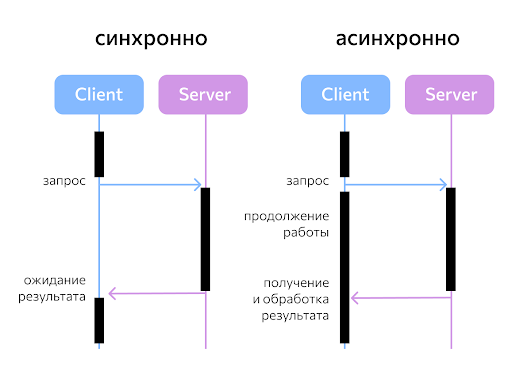
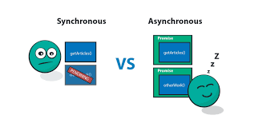

# Синхронный JavaScript

## Большая часть функциональности, которую мы рассматривали в предыдущих обучающих модулях, является синхронной — вы запускаете какой-то код, а результат возвращается, как только браузер может его вернуть. Давайте рассмотрим простой пример, как это работает:

## Пока выполняется каждая операция, ничего больше не может произойти — обработка (отображение) документа приостановлена. Так происходит, потому что JavaScript является однопоточным. В каждый момент времени может выполняться только одна команда, обрабатываемая в единственном — главном потоке. Все остальные действия блокируются до окончания выполнения текущей команды.

# Асинхронный JavaScript

## По причинам, упомянутым ранее (например, относящимся к блокировке), множество Web API особенностей теперь используют асинхронный код, особенно те,что имеют доступ к внешним устройствам или получают от них некоторые ресурсы, такие как получение файла из сети, запрос к базе данных и получение данных из базы, доступ к потоковому видео на веб-камере, просмотр дисплея на гарнитуре виртуальной реальности.

## Почему трудно работать, используя синхронный код? Давайте посмотрим на небольшой пример. Когда вы получаете картинку с сервера, вы не можете мгновенно вернуть результат. Это значит что следующий (псевдо) код не сработает:

>### let response = fetch("myImage.png");
>### let blob = response.blob();

## Это происходит потому что вы не знаете сколько времени займёт загрузка картинки, следовательно, когда вы начнёте выполнять вторую строку кода, сгенерируется ошибка (возможно, периодически, возможно, каждый раз), потому что response ещё не доступен. Вместо этого, ваш код должен дождаться возвращения response до того, как попытается выполнить дальнейшие инструкции.

## Есть два типа стиля асинхронного кода, с которыми вы столкнётесь в коде JavaScript, старый метод — колбэки (callbacks) и более новый — промисы (promises).

## Асинхронные колбэки — это функции, которые определяются как аргументы при вызове функции, которая начнёт выполнение кода на заднем фоне. Когда код на заднем фоне завершает свою работу, он вызывает колбэк-функцию, оповещающую, что работа сделана, либо оповещающую о трудностях в завершении работы. Обратные вызовы — немного устаревшая практика, но они все ещё употребляются в некоторых старомодных, но часто используемых API.

## При передаче колбэк-функции как аргумента в другую функцию, мы передаём только ссылку на функцию как аргумент, следовательно колбэк-функция не выполняется мгновенно. Она вызывается асинхронно внутри тела, содержащего функцию. Эта функция должна выполнять колбэк-функцию в нужный момент.

## Колбэк-функции универсальны — они не только позволяют вам контролировать порядок, в котором запускаются функции и данные, передающиеся между ними, они также позволяют передавать данные различным функциям, в зависимости от обстоятельств. Вы можете выполнять различные действия с загруженным ответом, такие как processJSON(), displayText(), и другие.

## Промисы — новый стиль написания асинхронного кода, который используется в современных Web API. Хорошим примером является fetch() API, который современнее и эффективнее чем XMLHttpRequest.

> fetch("products.json") 
>  .then((response) => { 
>    if (!response.ok) { 
>      throw new Error(`HTTP error: ${response.status}`); 
>    } 
>    return response.json(); 
>  }) 
>  .then((json) => initialize(json)) 
>  .catch((err) => console.error(`Fetch problem: ${err.message}`)); 

## В примере видно, как fetch() принимает один параметр — URL ресурса, который нужно получить из сети, — и возвращает промис. Промис — это объект, представляющий асинхронную операцию, выполненную удачно или неудачно. Он представляет собой как бы промежуточное состояние. По сути, это способ браузера сказать: "я обещаю вернуться к вам с ответом как можно скорее", поэтому в дословном переводе "промис" (promise) означает "обещание".

## Может понадобиться много времени, чтобы привыкнуть к данной концепции; это немного напоминает Кота Шрёдингера в действии. Ни один из возможных результатов ещё не произошёл, поэтому операция fetch в настоящее время ожидает результата. Далее у нас есть три блока кода следующих сразу после fetch():

